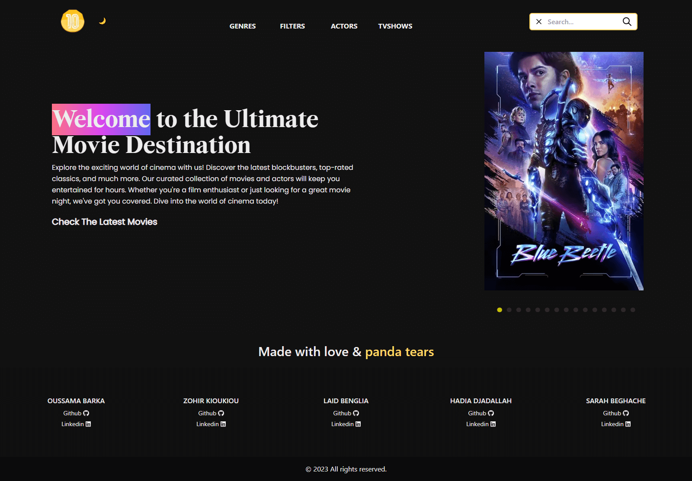

# 10Melon

## Description

10Melon is a web application that allows users to explore and discover movies and actors. It provides information about the latest movies, popular actors, and various movie genres. Users can also search for specific movies or actors. Additionally, the website offers a dark mode and pagination for a better user experience.

## Tools Used

- **NEXT.js**: A React framework for building server-rendered React applications.
- **Tailwind CSS**: A utility-first CSS framework for fast and responsive web development.
- **Slicker**: A library for creating beautiful and responsive carousels and sliders.
- **nextjs-progressbar**: A progress bar component for Next.js applications.
- **Fonts**: We used the "Poppins-Regular" and "Wremena Bold" fonts to enhance the website's typography.

## Team Members

- Oussama
- Hadia
- Zohir
- Laid
- Sarah

## Getting Started

To run this project locally, follow these steps:

1. Clone the repository: `git clone [[https://github.com/your-username/10melon.git](https://github.com/202306-NEA-DZ-FEW/movie-project-alfrak-betikh)](https://github.com/202306-NEA-DZ-FEW/movie-project-alfrak-betikh)`
2. Navigate to the project directory: `cd movie-project-alfrak-betikh`
3. Install dependencies: `npm install`
4. Start the development server: `npm run dev`
5. Open your browser and visit `http://localhost:3000`

## Features

- Dynamic movie lists (Top Rated, Popular, Latest, Now Playing, Upcoming).
- Detailed movie information (poster, title, release date, runtime, language, rating, director, overview).
- List of main actors for each movie.
- Related movies section.
- Movie trailers from YouTube.
- Production company information.
- List of popular actors with their details.
- Responsive design for various devices.
- Dark mode for comfortable viewing at night.
- Pagination for navigating through long lists of movies and actors.

## License

This project is licensed under the [MIT License](LICENSE).
